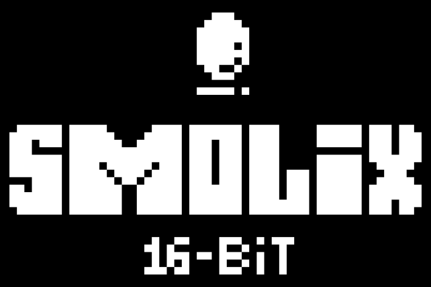
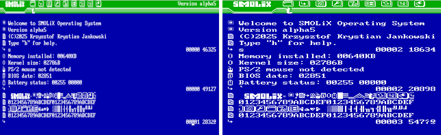
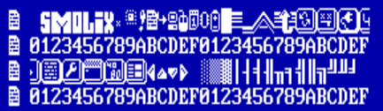

Real Mode, Raw Power.

Homebrew, research, 16-bit operating system for x86 processors. Targeting retro computers (486).



## ALPHA STAGE
This code is in alpha stage. This means that all the documentation/manual is constantly outdated. I try to commit only working code but sometimes that means that features are removed before refactor.

## Technical Details

SMOLiX is a minimalist operating system designed to run in x86 Real Mode (16-bit). It embraces the simplicity and raw performance of direct hardware access, while providing a unique graphical user interface.



### Architecture
- **Processor Target**: x86 (486+ compatible)
- **Mode**: Real mode (16-bit)
- **Memory Model**: Segmented memory model
- **Boot Method**: Standard floppy disk boot
- **Minimal Hardware**:
  - CPU: 486
  - Graphics: EGA
  - RAM: 256KB

### Development Tools
- **Assembly Language**: FASM (Flat Assembler)
- **Build System**: Make
- **Emulation**: QEMU/Bochs
- **Graphics Tool**: Custom Python tileset converter (tileset2glyphs.py)
- **Disk Image Creation**: dd (direct disk utility)

### Functions:
- **Bootloader**
  - Loads kernel from disk
  - Sets up initial environment
  - Transfers control to kernel entry point
  - Boot parameters configuration

- **Kernel**
  - int 0x60 System calls:
    - Reset, system initialization
    - Version information
    - Print char
    - Print string
    - Set color
    - Load glyph
    - Load all glyphs for the UI
    - Draw glyph
    - Draw multi-char glyph
    - Get key from input
    - Handle text input
    - Process keyboard events
    - Memory management routines
    - System statistics display
    - APM power management

- **Graphics System**
  - Custom glyph-based rendering
  - 16-color VGA support
  - Multiple video modes (40x25, 80x25)
  - Permanent header with logo and version



- **User Interface**
  - Icon-based toolbar
  - Command-line interface
  - Sound feedback for commands


## Building and Running

```
make        # Build the system
make run    # Run in QEMU
make clean  # Clean build artifacts
```

## Tileset 2 Glyphs

```/smolix/tool$ python3 tileset2glyphs.py tileset.png ../src/glyphs.asm```


# FOSS
Copyright (C) 2025 [Krzysztof Krystian Jankowski](https://krzysztofjankowski.com). This program is free software. See [LICENSE](LICENSE) for details.
