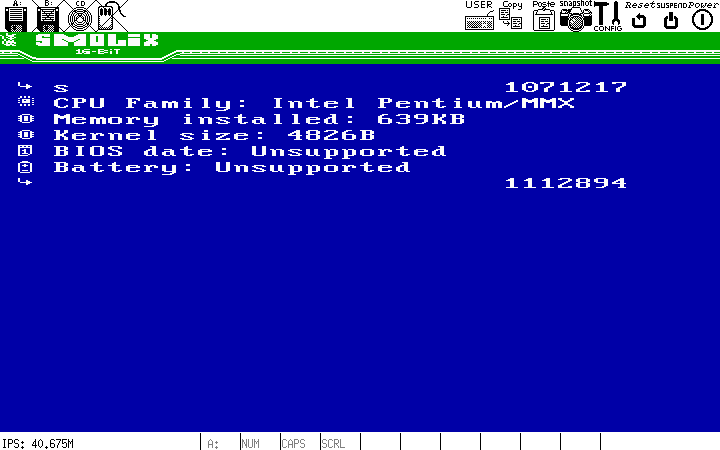

Real Mode, Raw Power.

Homebrew, research operating system for x86 processors. Targeting retro 32-bit computers (386+).


## CURRENT VERSION (0x0C)
This code is in active development. The kernel now uses hexadecimal version numbering and has moved beyond alpha stage. Current features are stable with ongoing development of the Dirty Rat game and file system.

## Technical Details

SMOLiX is a minimalist operating system designed to run in x86 Real Mode (16-bit). It embraces the simplicity and raw performance of direct hardware access, while providing a unique graphical user interface.


### Architecture
- **Processor Target**: x86 (386+ compatible)
- **Mode**: Real mode
- **Memory Model**: Segmented memory model
- **Boot Method**: Standard floppy disk boot
- **Minimal Hardware**:
  - CPU: 386+
  - Graphics: EGA/VGA
  - RAM: 256KB
- **Operating System**: Linux (development environment)

### Development Tools
- **Assembly Language**: FASM (Flat Assembler)
- **Build System**: Make
- **Emulation**: QEMU/Bochs
- **Graphics Tool**: Custom Python tileset converter (tileset2glyphs.py)
- **Disk Image Creation**: dd (direct disk utility)

### Functions:
- **Bootloader**
  - Loads kernel from disk
  - Sets up initial environment
  - Transfers control to kernel entry point
  - Boot parameters configuration

- **Kernel**
  - int 0x60 System calls:
    - Reset, system initialization
    - Version information
    - Print char
    - Print string
    - Set color
    - Load glyph
    - Load all glyphs for the UI
    - Draw glyph
    - Draw multi-char glyph
    - Get key from input
    - Handle text input
    - Process keyboard events
    - Memory management routines
    - System statistics display
    - APM power management
  - **DSKY Interface**: Apollo-inspired VERB/NOUN command system
    - VERB codes for actions (00-99)
    - NOUN codes for data objects (00-99)
    - Visual feedback with highlighted input fields
    - Type 'v' for VERB input, 'n' for NOUN input, ENTER to execute

- **Graphics System**
  - 16-color EGA/VGA support
  - Multiple video modes (40x25, 80x25)
  - Permanent header with logo and version


- **User Interface**
  - DSKY (Display & Keyboard) interface inspired by Apollo Guidance Computer
  - Virtual screen paging system
  - Screen saver for CRT monitor protection
  - Sound feedback for commands
  - System statistics display
  - **Dirty Rat Game**: Mini-game with player movement, broom entities, and floppy collection




## DSKY Commands

The DSKY (Display & Keyboard) interface is inspired by the Apollo Guidance Computer and uses a VERB/NOUN command system:

- **VERB**: Specifies the action to perform (00-99)
- **NOUN**: Specifies the data object or parameter (00-99)

### How to Use DSKY

1. Press `v` to enter VERB input mode (field highlights in red)
2. Type a 2-digit VERB code (e.g., `00`)
3. Press `n` to enter NOUN input mode (field highlights in red)
4. Type a 2-digit NOUN code (e.g., `00`)
5. Press `ENTER` to execute the command
6. Press `ESC` to clear and start over

### Available Commands

| VERB | NOUN | Command | Description |
|------|------|---------|-------------|
| 00   | 00   | Help    | Display all available commands |
| 01   | 01   | Version | Show kernel version information |
| 01   | 02   | Stats   | Display comprehensive system statistics |
| 30   | XX   | Files   | List files on floppy disk |
| 31   | XX   | Read    | Read file (NOUN number) to buffer |
| 32   | XX   | Display | Display current buffer content |
| 33   | XX   | Write   | Write buffer to floppy disk |
| 34   | XX   | Clear   | Clear file buffer |
| 50   | 00   | Game    | Enter Dirty Rat mini-game |

### Examples

- `VERB 00, NOUN 00` - Show help and all available commands
- `VERB 01, NOUN 02` - Display system statistics  
- `VERB 31, NOUN 01` - Read file #1 to buffer
- `VERB 50, NOUN 00` - Start the Dirty Rat game

## Building and Running

```
make        # Build the system
make run    # Run in QEMU
make debug  # Run in Bochs
make burn   # Burn to floppy disk
make clean  # Clean build artifacts
```

## Tileset 2 Glyphs

```/smolix/tool$ python3 tileset2glyphs.py tileset.png ../src/glyphs.asm```


# FOSS
Copyright (C) 2025 [Krzysztof Krystian Jankowski](https://krzysztofjankowski.com). This program is free software. See [LICENSE](LICENSE) for details.
